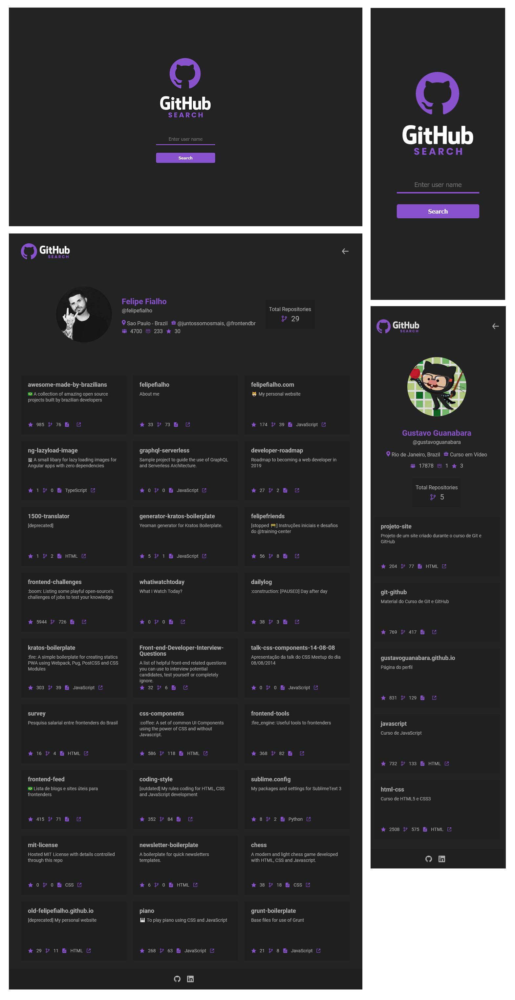

<p align='center'></p>
<br>
<p align='center'>


</p>

<h3>🔖 Sobre o projeto</h3>
<p>Projeto desenvolvido em Javascript puro para consumir a API do Github. Basta digitar um usuário do Github e a aplicação irá retornar dados do perfil procurado.  <p>

<h3>🚀 Tecnologias</h3>
<ul>
    <li>Html</li>
    <li>Css</li>
    <li>Javascript Vanilla</li>
    <li>Git</li>
    <li>NPM</li>
    <li>Eslint</li>
    <li>Webpack</li>
    <li>Babel</li>
</ul>

<h3>ℹ️ Como usar</h3>

<h4>ℹ️ Pré-requisitos</h4>

<ul>
    <li><a href="https://git-scm.com/" target="_blank">Git</a></li>
    <li><a href="https://marketplace.visualstudio.com/items?itemName=ritwickdey.LiveServer" target="_blank">Live Server</a></li>
</ul>

<h4>ℹ️ Rodando Projeto</h4>

```bash

# Clone o repositório
$ git clone https://github.com/Diegooliveyra/Github-Search.git

# Acesse a pasta do projeto no terminal
$ cd src/
Abra o projeto pelo Live serve no VSCode

# Execute o arquivo
$ index.html

```

</br>
<h3 align="center"><a href="https://github-search-profiles.netlify.app/" target="_blank">🚀 Link do Projeto 🚀</a></h3>
</br>

<h3>🖼 Layout</h3>



<h3>📝 Licença</h3>
<p>O projeto se encontra sob licença MIT. Para mais detalhes, acesse <a href='LICENSE'>license<a>.</p>
<p>Criado com 💙 por <a href='https://github.com/Diegooliveyra/' target='blank'>Diego Oliveira</a></p>
